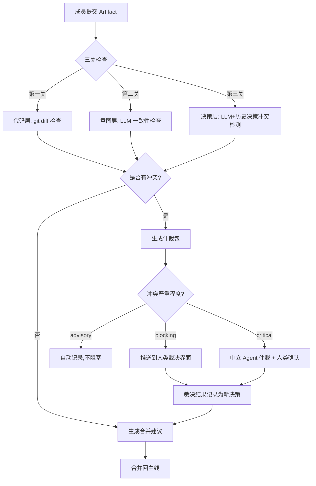

# Backbone Conductor 架构设计

> **历史设计提案**：当前架构以[实现说明](../IMPLEMENTATION.md)和代码为准。下文的 DSH 插件伪代码、MCP client 充当 server 和 SQLite 方案不是当前实现。

> **提案版本**：v1.0（非软件发布版本）
> **状态**：归档
> **关联文档**：[PROTOCOL_SPEC.md](./PROTOCOL_SPEC.md) · [PLAN.md](./PLAN.md)

---

## 1. 系统架构总览

```
┌─────────────────────────────────────────────────────────────┐
│                    Backbone Protocol (协议层)                 │
│  定义意图、决策、任务、冲突的抽象对象模型与状态机              │
│  详见 PROTOCOL_SPEC.md                                       │
└─────────────────────────────────────────────────────────────┘
                              │
┌─────────────────────────────────────────────────────────────┐
│              Backbone Conductor (自动化大脑)                  │
│  ┌──────────┐ ┌──────────┐ ┌──────────┐ ┌──────────┐        │
│  │ Intent   │ │ Decision │ │ Conflict │ │ Task     │        │
│  │ Engine   │ │ Ledger   │ │ Arbiter  │ │ Dispatch │        │
│  └──────────┘ └──────────┘ └──────────┘ └──────────┘        │
│  ┌──────────────────────────────────────────────────┐        │
│  │              Backbone Sync Engine                  │        │
│  │  (Git-native: 每个 Backbone 状态都是一个 commit)  │        │
│  └──────────────────────────────────────────────────┘        │
│  ┌──────────────────────────────────────────────────┐        │
│  │         DeepSeek Harness (DSH) 插件运行时         │        │
│  │  所有组件以插件形式组装：模型、工具、循环、编排    │        │
│  └──────────────────────────────────────────────────┘        │
└─────────────────────────────────────────────────────────────┘
                              │
┌─────────────────────────────────────────────────────────────┐
│                 Integration Layer (接入层)                    │
│  MCP Server  │  Git Hooks  │  CLI  │  Web Dashboard (可选)   │
└─────────────────────────────────────────────────────────────┘
                              │
┌─────────────────────────────────────────────────────────────┐
│              Agent Runtime Adapters (Agent 适配层)            │
│  Codex Adapter  │  Claude Code Adapter  │  Custom Adapter    │
└─────────────────────────────────────────────────────────────┘
```

---

## 2. 核心组件

| 组件 | 职责 | 实现方式 |
|------|------|----------|
| **Backbone Protocol** | 定义对象模型、状态机、接口规范 | Python dataclasses + JSON Schema（见 PROTOCOL_SPEC.md） |
| **Conductor Agent** | 自动化大脑，协调所有组件 | 基于 DeepSeek Harness 插件组装 |
| **Intent Engine** | 意图生命周期管理 | DSH 插件 `IntentPlugin` |
| **Decision Ledger** | 决策记录与追溯 | DSH 插件 `DecisionPlugin` |
| **Conflict Arbiter** | 冲突检测与仲裁 | DSH 插件 `ConflictDetectorPlugin` + `ArbiterPlugin` |
| **Task Dispatcher** | 任务分派与状态跟踪 | DSH 插件 `TaskDispatcherPlugin` |
| **Backbone Sync Engine** | Git commit 生成与同步 | Python + GitPython / subprocess |
| **MCP Server** | 成员接入接口 | DSH `dsh-mcp-client` 插件 |
| **Agent Runtime Adapters** | 适配不同 Coding Agent | MCP 协议统一接入 |

---

## 3. DeepSeek Harness 插件设计

Conductor 基于 **DeepSeek Harness（DSH）** 构建。DSH 的“一切皆插件”架构允许我们将 Protocol 对象、冲突检测规则、任务分派逻辑都实现为可组装插件，保持运行时的高度可控。

### 3.1 插件清单

| 插件名 | 类型 | 职责 |
|--------|------|------|
| `BackboneProtocolPlugin` | 核心 | 注册 Intent / Decision / Conflict 类型 |
| `IntentPlugin` | 核心 | 意图生命周期管理 |
| `DecisionPlugin` | 核心 | 决策记录与覆盖链 |
| `ConflictDetectorPlugin` | 核心 | 确定性冲突检测规则 |
| `ArbiterPlugin` | 核心 | 仲裁包生成与裁决流程 |
| `TaskDispatcherPlugin` | 核心 | 任务分派与上下文推送 |
| `MCPClientPlugin` | 接入 | 连接成员 MCP Server |
| `SessionPlugin` | 基础设施 | 会话记忆（SQLite） |
| `TracingPlugin` | 可观测 | Trace 导出（Console / 自托管） |

### 3.2 组装示例

```python
# conductor/agent.py
from dsh import Agent, Plugin, PluginContext
from dsh.plugins import MCPClientPlugin, SessionPlugin, TracingPlugin


class BackboneProtocolPlugin(Plugin):
    """将 Backbone Protocol 对象模型注册为 DSH 插件"""

    name = "backbone-protocol"

    def setup(self, ctx: PluginContext):
        ctx.register_type("Intent", Intent)
        ctx.register_type("Decision", Decision)
        ctx.register_type("Conflict", Conflict)


class ConflictDetectorPlugin(Plugin):
    """确定性冲突检测规则插件"""

    name = "conflict-detector"

    def setup(self, ctx: PluginContext):
        ctx.register_tool("check_conflict", self.check_conflict)

    async def check_conflict(self, intent_id: str) -> dict:
        # 实现 replace_vs_extend 等确定性规则
        ...


class TaskDispatcherPlugin(Plugin):
    """任务分派插件"""

    name = "task-dispatcher"

    def setup(self, ctx: PluginContext):
        ctx.register_tool("dispatch_task", self.dispatch_task)

    async def dispatch_task(self, member_id: str, task_spec: str) -> dict: ...


# 组装 Conductor
conductor = Agent(
    name="conductor",
    plugins=[
        BackboneProtocolPlugin(),
        ConflictDetectorPlugin(),
        TaskDispatcherPlugin(),
        MCPClientPlugin(server="member-mcp"),
        SessionPlugin(storage="sqlite:///backbone.db"),
        TracingPlugin(exporter="console"),
    ],
    instructions=BACKBONE_INSTRUCTIONS,
)
```

---

## 4. Git-Native Backbone 集成

Backbone 状态存储在项目仓库的 `.backbone/` 目录下，每次变更产生一个 Git commit。

### 4.1 目录结构

详见 [PROTOCOL_SPEC.md §3](./PROTOCOL_SPEC.md#3-git-native-backbone-结构)。

### 4.2 同步机制

```
成员提交 Artifact
        │
        ▼
Conductor 执行三关检查
        │
        ▼
检查通过 → 写入 .backbone/ → git add + commit
        │
        ▼
git push origin backbone
        │
        ▼
其他成员下次启动时 pull 最新 backbone
```

**Commit message 格式**：`backbone: <object_type> <id> <action> by <author>`

示例：
- `backbone: intent 0001 accepted by alice`
- `backbone: decision 0012 proposed by bob`
- `backbone: conflict 0003 resolved by tech-lead`

---

## 5. 冲突检测与仲裁流程



**三关检查细节**：

| 关卡 | 检查方式 | 失败处理 |
|------|----------|----------|
| 代码层 | `git diff --check main...member-branch` | 生成代码冲突报告 |
| 意图层 | LLM 校验制品是否满足 `intent` 和 `spec` | 生成意图不一致报告 |
| 决策层 | LLM + 历史决策冲突检测 | 生成仲裁包 |

---

## 6. 技术选型

| 组件 | 技术选择 | 理由 |
|------|----------|------|
| **开发语言** | Python 3.12+ | 开发效率高，生态丰富，团队熟悉 |
| **Agent 框架** | **DeepSeek Harness（DSH）** | 全插件机制，编排可控，可组装；模型无关，避免厂商锁定；社区活跃 |
| **Protocol 定义** | Python dataclasses + JSON Schema | 类型安全，可序列化，易与 Git 集成 |
| **Backbone 存储** | Git 仓库 + `.backbone/` 目录 | Git-native 审计，天然版本控制 |
| **MCP Server** | Python + `dsh-mcp-client` 插件 | 与 DSH 生态一致，原生支持 MCP |
| **冲突检测** | 确定性规则 + LLM 辅助 | 双层检测，确定性规则处理可形式化冲突，LLM 处理语义冲突 |
| **运行时** | FastAPI + Uvicorn | 轻量，易于迁移到任何云环境 |
| **数据库** | SQLite（工作内存）+ Git（长期记忆） | local-first，无外部依赖 |
| **未来性能优化** | Rust（可选，Phase 6+） | 仅当并发会话数或冲突检测延迟成为瓶颈时引入 |

**为什么选择 DeepSeek Harness 而不是 OpenAI Agents SDK：**

- **插件化架构**：DSH 的“一切皆插件”与 Backbone Protocol 的“Protocol 与 Runtime 解耦”设计高度一致，所有组件可替换、可组装。
- **模型无关**：作为有开源计划的项目，底层框架的中立性至关重要。DSH 允许自由切换和混用不同供应商的模型。
- **社区生态**：DSH 社区已有 `agent-team`、`dsh-agent-teams` 等多 Agent 协作插件，可直接借鉴或集成。
- **编排可控**：DSH 通过配置层组合插件，支持复杂的 DAG 工作流和层级式多 Agent 协作，比 OpenAI Agents SDK 的扁平 Handoffs 更灵活。

---

## 7. 部署拓扑

```
┌─────────────────────────────────────────────┐
│              团队服务器 (VPS / 云主机)        │
│  ┌─────────────────────────────────────┐    │
│  │  Docker Compose                     │    │
│  │  ┌─────────────┐  ┌─────────────┐  │    │
│  │  │ Conductor   │  │ MCP Server  │  │    │
│  │  │ (FastAPI)   │  │ (FastMCP)   │  │    │
│  │  └─────────────┘  └─────────────┘  │    │
│  │  ┌─────────────┐  ┌─────────────┐  │    │
│  │  │ SQLite      │  │ Git Repo    │  │    │
│  │  │ (工作内存)   │  │ (.backbone) │  │    │
│  │  └─────────────┘  └─────────────┘  │    │
│  └─────────────────────────────────────┘    │
└─────────────────────────────────────────────┘
              │                    │
              ▼                    ▼
      ┌─────────────┐      ┌─────────────┐
      │ 成员 A 电脑  │      │ 成员 B 电脑  │
      │ Codex + MCP │      │ Codex + MCP │
      └─────────────┘      └─────────────┘
```

**部署方式**：Docker Compose，所有依赖容器化，便于迁移到任何云环境。
